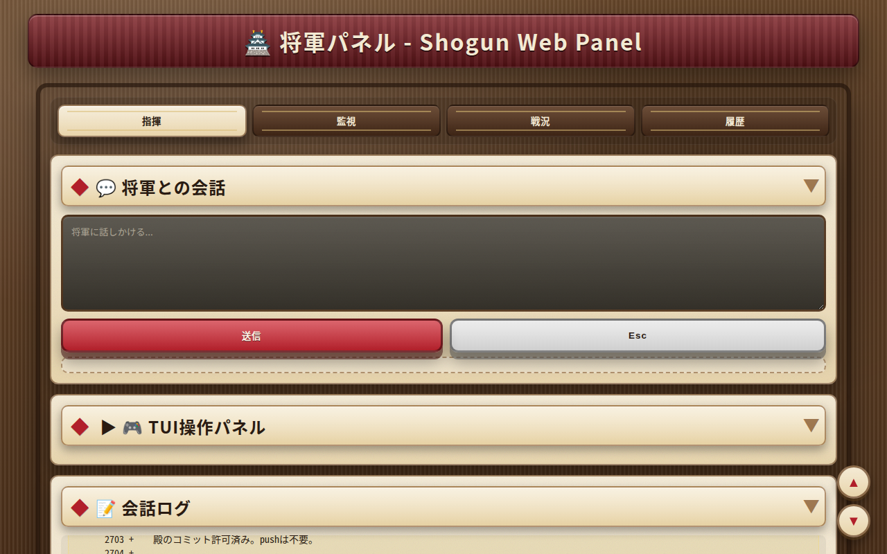
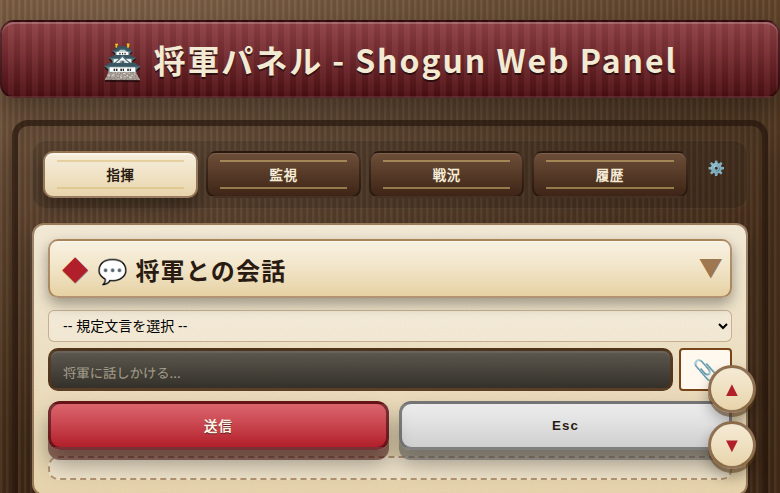
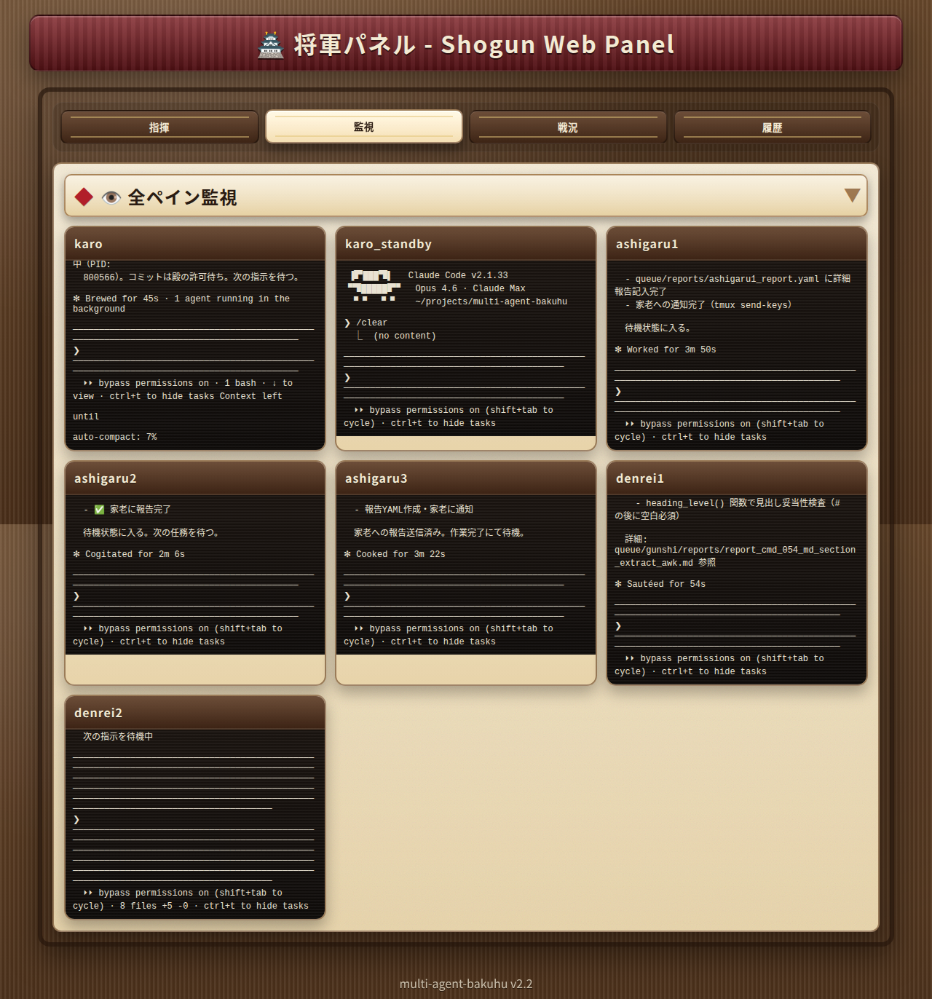
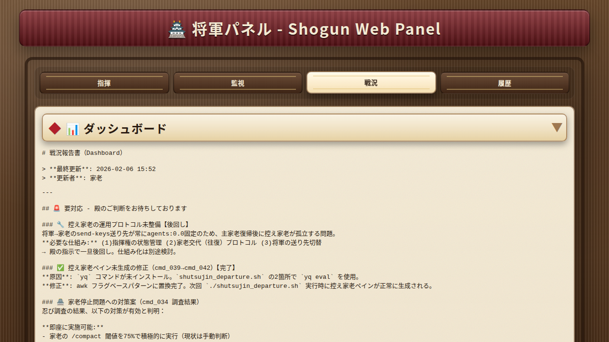
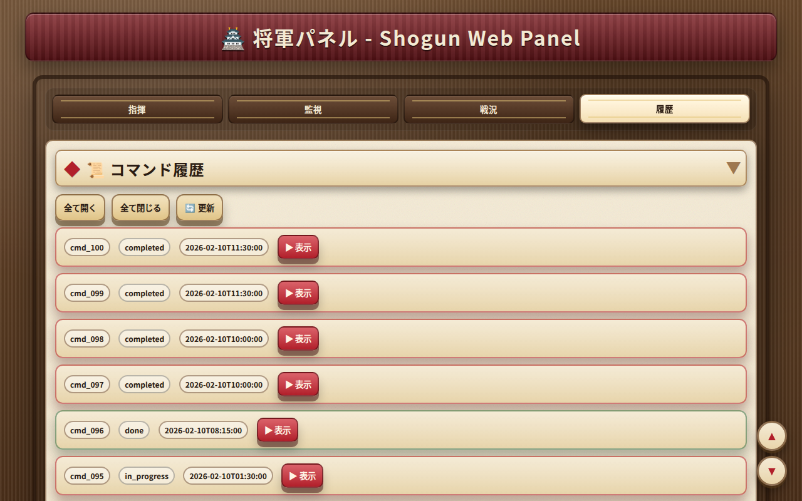

# multi-agent-shogun-tenshukaku

> This project is a web control panel originally built for [yohey-w/multi-agent-shogun](https://github.com/yohey-w/multi-agent-shogun) and its forks. Compatible with any multi-agent-shogun family system via `config/settings.yaml`.

Web-based control panel for multi-agent-shogun orchestration systems. Named after the castle keep (天守閣) — the commander's vantage point overlooking the entire battlefield.



## Overview

Tenshukaku provides a browser-based interface for commanding and monitoring a fleet of AI agents (Claude Code instances) running in tmux. Instead of switching between terminal panes, the human operator ("殿") can issue commands, monitor all agents, review the dashboard, and browse command history — all from a single web page.

## Features

### Command Tab (指揮)

Send messages directly to the Shogun agent's tmux pane. Supports Ctrl+Enter for quick submission and an Escape key button to interrupt Claude Code when needed. Includes Top/Bottom scroll buttons for navigating long output.

The **input textarea auto-resizes** from a single row up to a configurable maximum (default: 8 rows, adjustable in Settings). A **Template Phrases** dropdown appears above the textarea when phrases are configured — selecting a phrase inserts it at the cursor position, enabling repeated use without losing existing text.

A collapsible **TUI Operation Panel** provides direct keyboard input: arrow keys, Enter, Tab, Space, Backspace, number keys (0-9), and Yes/No confirmation buttons — useful for navigating interactive CLI interfaces without leaving the browser. Critical keys (Enter, Escape, Yes, No) require a 1-second long-press to prevent accidental activation.

The **Chat Log** section displays a conversation-style view of interactions: user messages appear in blue and shogun responses in gold. The raw tmux pane output is available in a collapsible section below the chat log.


#### File Attachment (📎)

The **📎 file attachment button** sits to the right of the textarea, allowing files to be sent directly to Claude Code's tmux pane via the file-path delivery mechanism.



**How it works:**

1. The browser Base64-encodes the file and sends it to `/api/file-paste`
2. The server saves the file to `/tmp/tenshukaku-images/` with a timestamp+UUID filename
3. The file path is delivered to the Shogun pane via `tmux send-keys`
4. Claude Code receives the path and reads the file using the `Read` tool — enabling full recognition of images, PDFs, text, code files, and more

**Supported input methods:**
- **📎 button** — click to open a file picker (multiple files supported)
- **Drag & drop** — drag files onto the command input section; a drop overlay appears on `dragenter`
- **Ctrl+V / paste** — paste images from the clipboard directly into the textarea
- Files are **staged** as chips below the textarea and sent together with the next text message

**Accepted file types:** All file types accepted. The extension is derived from the filename (sanitized to alphanumeric characters only) and used as-is for saving. Images >5 MB are resized client-side (Canvas, JPEG 85%) before upload to reduce transfer size.

**Security:**
- Path traversal prevention via `os.path.realpath()` check

**Automatic cleanup:**
- On startup: all existing `tenshukaku_*` files in `/tmp/tenshukaku-images/` are deleted
- Every 5 minutes: files older than 30 minutes are removed
- File count cap: oldest files are pruned when the directory exceeds 50 entries

### Monitor Tab (監視)

Real-time grid view of all agent panes using WebSocket delta updates for efficient bandwidth usage. Update interval is configurable (default: 5 seconds). A **Clear Display** button resets the monitor view without affecting tmux pane history (non-destructive). User input lines are highlighted in light blue for easy identification.



### Dashboard Tab (戦況)

Renders the `dashboard.md` battle report — task progress, blockers, skill candidates, and daily achievements. Content is loaded on demand via a manual **Refresh** button (auto-refresh has been removed to reduce unnecessary API calls).

Supports two display modes via a **Raw/Rendered toggle**:
- **Rendered mode** (default): Parses markdown using [marked.js](https://marked.js.org/) with [github-markdown-css](https://github.com/sindresorhus/github-markdown-css), styled with custom Sengoku-era theme overrides for tables, headings, code blocks, blockquotes, and other elements.
- **Raw mode**: Displays the original markdown source text as-is.



### History Tab (履歴)

Browse the command queue (`shogun_to_karo.yaml`) with expandable details for each command. Includes bulk open/close controls.



### Bakuhu Tab (幕府)

Displays the **Inter-Bakuhu Network** peer list — secondary shogun instances connected to this node. Shows Peer ID, name, connection status, and Base URL for each registered peer. A **🔄 Refresh** button triggers a manual refresh via `GET /bakuhu/peers` (30-second server-side cache).

This tab is visible only when `config/settings.yaml` contains a `bakuhu` configuration block.
When Inter-Bakuhu mode is enabled, the header also shows a **role badge** so operators can immediately tell whether the current node is running as a `primary` or `secondary` bakuhu.

### Settings Page (設定) — `GET /settings`

Accessible via the ⚙️ icon in the navigation bar. Allows runtime configuration without editing `settings.yaml` directly:

- **Monitor polling interval** — base and max interval (ms) for the agent monitor grid
- **Shogun polling interval** — base and max interval (ms) for the shogun pane WebSocket feed
- **Input textarea max rows** — maximum row height before the textarea becomes scrollable (1–50)
- **Template phrases** — add/edit/delete preset phrases shown in the Command Tab dropdown

Settings are written atomically to `config/settings.yaml` via `PUT /api/settings` and take effect immediately in the running app.

## Architecture

```
Browser (HTTP + WebSocket)
    │
    ├── GET  /              → Main SPA (Jinja2 templates + htmx)
    ├── GET  /settings      → Settings page
    ├── POST /api/command   → tmux send-keys to shogun pane
    ├── POST /api/special-key → Send special keys (allowlist-based)
    ├── POST /api/monitor/clear → Clear monitor display (non-destructive)
    ├── GET  /api/dashboard → Read dashboard.md (raw markdown in data container)
    ├── GET  /api/history   → Read shogun_to_karo.yaml
    ├── GET  /api/ws-config → WebSocket reconnection configuration
    ├── GET  /api/settings  → Read user-configurable settings (JSON)
    ├── PUT  /api/settings  → Update and persist settings atomically
    ├── POST /api/file-paste → Save file to /tmp/tenshukaku-images/ and send path via send-keys
    ├── POST /api/image-paste → Backward-compatible alias for /api/file-paste (image-only legacy)
    ├── WS   /ws            → Real-time shogun pane output (delta)
    └── WS   /ws/monitor    → Real-time all-pane monitoring (delta)
    │
    ▼
FastAPI + Uvicorn
    │
    ▼
TmuxBridge (libtmux)
    │
    ▼
tmux sessions (shogun / multiagent)
```

### Tech Stack

| Component | Technology |
|-----------|-----------|
| Backend | FastAPI + Uvicorn |
| Templates | Jinja2 |
| Frontend | htmx 2.x + Vanilla JS |
| WebSocket | FastAPI native WebSocket (delta diff delivery) |
| Markdown Rendering | marked.js + github-markdown-css |
| tmux Integration | libtmux 0.53+ |
| Terminal Rendering | xterm.js + image addon |
| Styling | Custom CSS (Sengoku-era theme) |
| Package Manager | uv |

### WebSocket Reconnection

WebSocket connections use a `ReconnectingWebSocket` class with:
- Automatic reconnection with exponential backoff (1s to 30s)
- Maximum 3 retry attempts before showing a manual **Reconnect** button
- UI display delay to suppress transient disconnection indicators
- All thresholds derived from `settings.yaml` via `/api/ws-config` (no hardcoded values)

## Setup

### Prerequisites

- Python 3.13+
- [uv](https://docs.astral.sh/uv/) package manager
- tmux with active `shogun` and `multiagent` sessions (from [multi-agent-bakuhu](https://github.com/yaziuma/multi-agent-bakuhu))

### Installation

```bash
git clone https://github.com/yaziuma/multi-agent-shogun-tenshukaku.git
cd multi-agent-shogun-tenshukaku

# Install dependencies
uv sync

# Create configuration file from example
cp config/settings.yaml.example config/settings.yaml
```

### Configuration

Edit `config/settings.yaml`:

```yaml
server:
  host: "0.0.0.0"
  port: 30001

bakuhu:
  base_path: "/path/to/multi-agent-bakuhu"

tmux:
  shogun_session: "shogun"
  multiagent_session: "multiagent"
  shogun_pane: "0.0"

runtime:
  thread_pool_workers: 2

monitor:
  base_interval_ms: 5000
  max_interval_ms: 10000
  no_change_threshold: 2

shogun:
  base_interval_ms: 1000
  max_interval_ms: 3000
  no_change_threshold: 2

ui:
  user_input_color: "#4FC3F7"
  textarea_max_rows: 8
  template_phrases:
    - label: "状況確認"
      text: "状況確認"
    - label: "家老呼ぶ"
      text: "家老に確認しろ！"
```

The `ui.textarea_max_rows` and `ui.template_phrases` fields can also be edited at runtime via the Settings page (`/settings`).

### Running

```bash
# Using the start script (recommended — handles process management)
./start.sh

# Development restart (full cache cleanup + hot reload)
./restart.sh

# Or manually
uv run uvicorn main:app --host 0.0.0.0 --port 30001
```

Access at `http://<your-host>:30001`

## Project Structure

```
multi-agent-shogun-tenshukaku/
├── main.py                  # FastAPI application & API routes
├── ws/
│   ├── broadcasters.py     # Broadcast managers (shogun + monitor)
│   ├── dashboard_cache.py  # mtime-based dashboard file cache
│   ├── delta.py            # Delta diff computation for WebSocket updates
│   ├── handlers.py         # WebSocket handlers (shogun + monitor)
│   ├── runtime.py          # Thread pool executor + async lock
│   ├── state.py            # Pane state diff detection (sha1)
│   └── tmux_bridge.py      # tmux session interaction layer
├── templates/
│   ├── base.html            # Base template (header, footer, CDN assets)
│   ├── index.html           # Main SPA (4 tabs + JS)
│   ├── settings.html        # Settings page (polling intervals, template phrases)
│   └── partials/
│       ├── history.html     # Command history partial
│       ├── output.html      # Pane output partial
│       └── status.html      # Status display partial
├── static/
│   └── style.css            # Sengoku-era themed CSS (incl. markdown overrides)
├── config/
│   └── settings.yaml        # Server, bakuhu path, tmux & monitor configuration
├── tests/
│   ├── test_api.py                      # API endpoint tests
│   ├── test_bakuhu.py                   # Inter-Bakuhu route and behavior tests
│   ├── test_broadcasters.py             # Broadcaster unit tests
│   ├── test_dashboard_markdown.py       # Dashboard markdown rendering tests (Playwright)
│   ├── test_dashboard_refresh.py        # Dashboard manual refresh tests (Playwright)
│   ├── test_dashboard_table_dark_theme.py # Table dark theme CSS tests (Playwright)
│   ├── test_delta.py                    # Delta diff computation tests
│   ├── test_logging_config.py           # Logging and audit log tests
│   ├── test_monitor.py                  # Monitor WebSocket tests
│   ├── test_sanitize.py                 # Input sanitization tests
│   ├── test_tmux_bridge.py              # TmuxBridge unit tests
│   ├── test_ws_core.py                  # PaneState & DashboardCache tests
│   └── test_ws_endpoints.py             # WebSocket endpoint tests
├── start.sh                 # Safe startup script
├── restart.sh               # Development restart script
├── pyproject.toml           # Project metadata & dependencies
└── assets/
    └── screenshots/         # UI screenshots
```

## Testing

```bash
uv run pytest
```

## Compatibility

Tenshukaku works with any multi-agent-shogun family system. All session names, pane targets, and base paths are configurable via `config/settings.yaml`.

| System | Compatibility |
|--------|--------------|
| [yaziuma/multi-agent-bakuhu](https://github.com/yaziuma/multi-agent-bakuhu) | Developed for this system |
| [yohey-w/multi-agent-shogun](https://github.com/yohey-w/multi-agent-shogun) | Compatible — adjust `bakuhu.base_path` and `tmux` session names in settings |

## 🏯 Inter-Bakuhu Network

Connect multiple Bakuhu instances across machines — delegate tasks from your primary
Bakuhu to secondary Bakuhu instances over a secure Tailscale VPN.

> **Full documentation**: [docs/inter-bakuhu/setup.md](docs/inter-bakuhu/setup.md)

| Feature | Description |
|---------|-------------|
| Multi-machine delegation | Send tasks from primary to secondary Bakuhu |
| WebSocket RPC/PubSub | Real-time bidirectional connection |
| Token authentication | Per-peer token isolation |
| Role enforcement | Only primary can initiate delegation |
| File transfer | Send files across Bakuhu nodes via `/bakuhu/files` (multipart upload, up to 200 MB) |
| Durable result retry | Failed delegation result returns are queued and retried automatically |

**Quick setup**: Set `bakuhu.role: primary` on your main machine, `role: secondary`
on the remote machine, configure `peers` with Tailscale IPs.
See [docs/inter-bakuhu/setup.md](docs/inter-bakuhu/setup.md) for full setup guide.

## Logging

- General application logs are emitted through Python `logging` and collected by the process manager.
- Inter-Bakuhu audit events are additionally written to daily JSONL files under `logs/inter-bakuhu/YYYY-MM-DD.jsonl`, making peer operations and delegation traffic easy to inspect later.

## Related Projects

- [multi-agent-bakuhu](https://github.com/yaziuma/multi-agent-bakuhu) — The core multi-agent orchestration system that Tenshukaku controls
- [multi-agent-shogun](https://github.com/yohey-w/multi-agent-shogun) — The upstream fork that bakuhu is based on

## License

MIT
