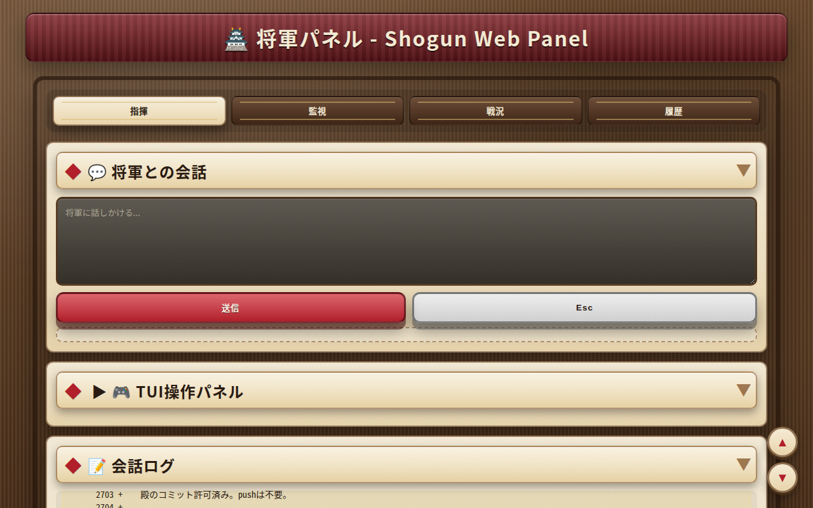
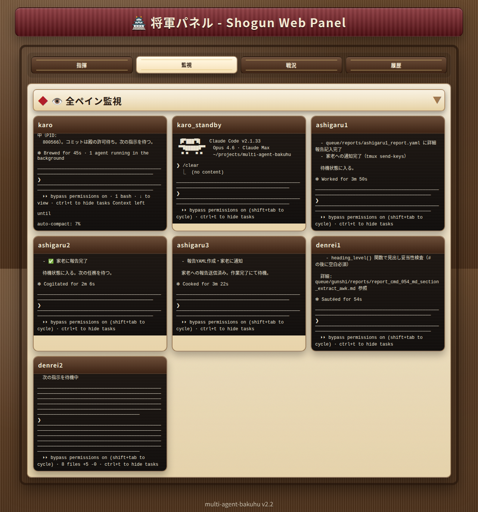
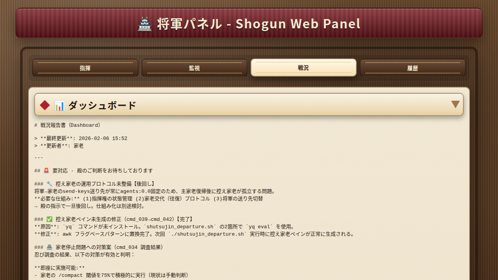
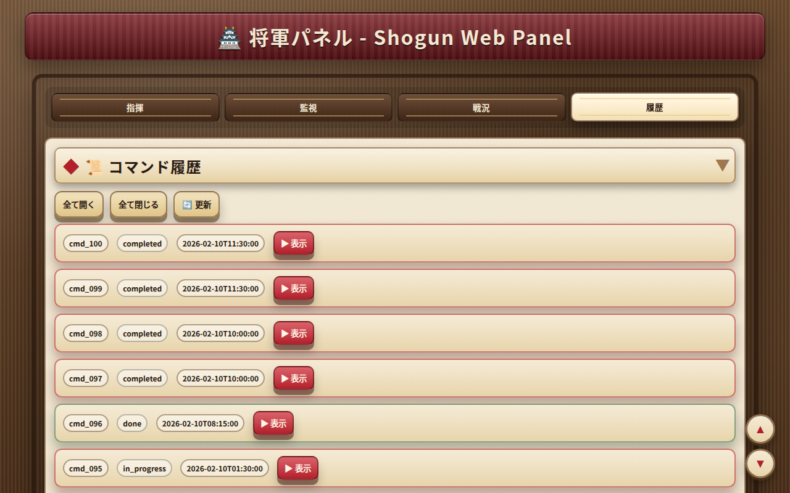

# multi-agent-shogun-tenshukaku

> [yohey-w/multi-agent-shogun](https://github.com/yohey-w/multi-agent-shogun) およびそのfork向けに開発されたWeb制御パネル。`config/settings.yaml` の設定変更のみで multi-agent-shogun 系システム全般に対応。

マルチエージェント統制システムのためのWeb制御パネル。天守閣 — 城主が戦場全体を見渡す司令塔にちなんで命名。



## 概要

天守閣は、tmux上で稼働する複数のAIエージェント（Claude Codeインスタンス）を、ブラウザから指揮・監視するためのWebインターフェースである。ターミナルのペインを切り替える代わりに、殿（人間オペレータ）は単一のWebページから指示送信、全エージェント監視、ダッシュボード閲覧、コマンド履歴の確認が可能。

## 機能

### 指揮タブ

将軍エージェントのtmuxペインに直接メッセージを送信する。Ctrl+Enterによるクイック送信と、Claude Codeの割り込みに使うEscapeキー送信ボタンを備える。ペイン出力は1秒間隔でリアルタイム更新。


### 監視タブ

全エージェントペインをグリッドレイアウトでリアルタイム表示。更新間隔は設定可能（デフォルト5秒）。



### 戦況タブ

`dashboard.md` の戦況報告書をレンダリング。タスク進行状況、ブロッカー、スキル候補、本日の戦果を5秒ごとに自動更新。



### 履歴タブ

コマンドキュー（`shogun_to_karo.yaml`）を展開可能な詳細付きで一覧表示。一括開閉ボタン付き。



## アーキテクチャ

```
ブラウザ (HTTP + WebSocket)
    │
    ├── GET  /              → メインSPA（Jinja2テンプレート + htmx）
    ├── POST /api/command   → tmux send-keys で将軍ペインに送信
    ├── POST /api/special-key → Escキー送信（許可リスト方式）
    ├── GET  /api/dashboard → dashboard.md 読み取り
    ├── GET  /api/history   → shogun_to_karo.yaml 読み取り
    ├── WS   /ws            → 将軍ペインのリアルタイム出力
    └── WS   /ws/monitor    → 全ペインリアルタイム監視
    │
    ▼
FastAPI + Uvicorn
    │
    ▼
TmuxBridge (libtmux)
    │
    ▼
tmuxセッション (shogun / multiagent)
```

### 技術スタック

| 要素 | 技術 |
|------|------|
| バックエンド | FastAPI + Uvicorn |
| テンプレート | Jinja2 |
| フロントエンド | htmx 2.x + Vanilla JS |
| WebSocket | FastAPI ネイティブ WebSocket |
| tmux連携 | libtmux 0.53+ |
| スタイリング | カスタムCSS（戦国テーマ） |
| パッケージ管理 | uv |

## セットアップ

### 前提条件

- Python 3.13+
- [uv](https://docs.astral.sh/uv/) パッケージマネージャ
- `shogun` および `multiagent` セッションが稼働中のtmux（[multi-agent-bakuhu](https://github.com/yaziuma/multi-agent-bakuhu) から起動）

### インストール

```bash
git clone https://github.com/yaziuma/multi-agent-shogun-tenshukaku.git
cd multi-agent-shogun-tenshukaku

# 依存関係のインストール
uv sync
```

### 設定

`config/settings.yaml` を編集:

```yaml
server:
  host: "0.0.0.0"
  port: 30000

bakuhu:
  base_path: "/path/to/multi-agent-bakuhu"

tmux:
  shogun_session: "shogun"
  multiagent_session: "multiagent"
  shogun_pane: "0.0"

runtime:
  thread_pool_workers: 2

monitor:
  base_interval_ms: 5000
  max_interval_ms: 10000
  no_change_threshold: 2

shogun:
  base_interval_ms: 1000
  max_interval_ms: 3000
  no_change_threshold: 2

ui:
  user_input_color: "#4FC3F7"
```

### 起動

```bash
# 起動スクリプト使用（推奨 — プロセス管理・ヘルスチェック付き）
./start.sh

# 開発用再起動（キャッシュ完全削除 + ホットリロード）
./restart.sh

# 手動起動
uv run uvicorn main:app --host 0.0.0.0 --port 30000
```

`http://<ホスト>:30000` でアクセス。

## プロジェクト構成

```
multi-agent-shogun-tenshukaku/
├── main.py                  # FastAPIアプリケーション & APIルート
├── ws/
│   ├── broadcasters.py     # ブロードキャストマネージャ（将軍 + 監視）
│   ├── dashboard_cache.py  # mtime ベースのダッシュボードキャッシュ
│   ├── handlers.py         # WebSocketハンドラ（将軍 + 監視）
│   ├── runtime.py          # スレッドプール + 非同期ロック
│   ├── state.py            # ペイン状態の差分検出（sha1）
│   └── tmux_bridge.py      # tmuxセッション操作レイヤー
├── templates/
│   ├── base.html            # ベーステンプレート（ヘッダ、フッタ、アセット）
│   ├── index.html           # メインSPA（4タブ + JS）
│   └── partials/
│       └── history.html     # コマンド履歴パーシャル
├── static/
│   └── style.css            # 戦国テーマCSS
├── config/
│   └── settings.yaml        # サーバー・bakuhuパス・tmux・監視設定
├── tests/
│   ├── test_api.py          # APIエンドポイントテスト
│   ├── test_broadcasters.py # ブロードキャスターテスト
│   ├── test_monitor.py      # 監視WebSocketテスト
│   ├── test_tmux_bridge.py  # TmuxBridgeユニットテスト
│   └── test_ws_core.py      # PaneState・DashboardCacheテスト
├── start.sh                 # 安全起動スクリプト
├── pyproject.toml           # プロジェクトメタデータ & 依存関係
└── assets/
    └── screenshots/         # UIスクリーンショット
```

## テスト

```bash
uv run pytest
```

## 互換性

天守閣は multi-agent-shogun 系システム全般で利用可能。セッション名、ペイン指定、ベースパスは全て `config/settings.yaml` で設定できる。

| システム | 互換性 |
|---------|--------|
| [yaziuma/multi-agent-bakuhu](https://github.com/yaziuma/multi-agent-bakuhu) | 本システム向けに開発 |
| [yohey-w/multi-agent-shogun](https://github.com/yohey-w/multi-agent-shogun) | 互換あり — settings の `bakuhu.base_path` と `tmux` セッション名を調整すれば利用可能 |

## 関連プロジェクト

- [multi-agent-bakuhu](https://github.com/yaziuma/multi-agent-bakuhu) — 天守閣が制御するマルチエージェント統制システム本体
- [multi-agent-shogun](https://github.com/yohey-w/multi-agent-shogun) — bakuhu のfork元

## ライセンス

MIT
