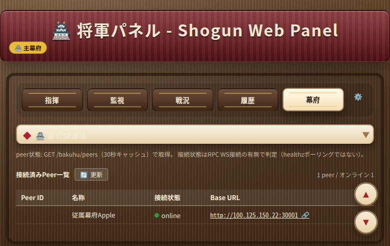
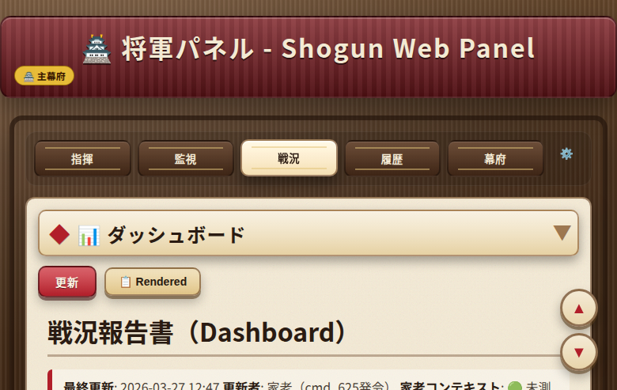
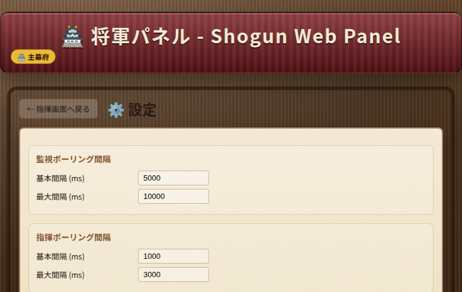
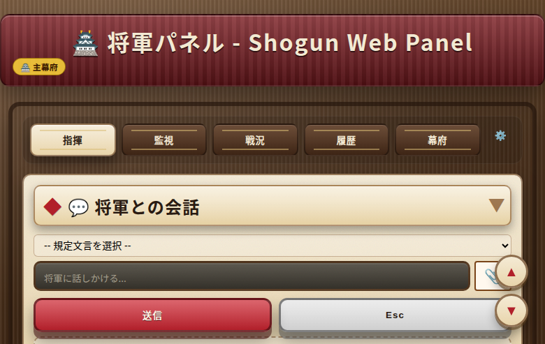
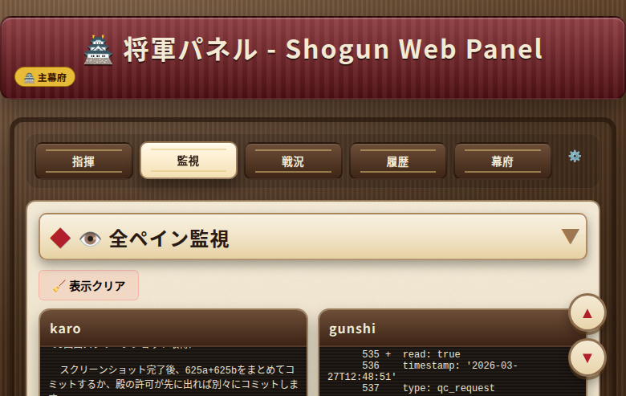

# Inter-Bakuhu ネットワーク（日本語版）

複数の Bakuhu インスタンスをマシン間で接続し、primary Bakuhu から secondary Bakuhu インスタンスへ Tailscale VPN 経由でタスクを委任します。

## 背景

Inter-Bakuhu Network は本プロジェクト（shogun-web / 天守閣）が提供するネットワーク機能で、[multi-agent-shogun](https://github.com/yohey-w/multi-agent-shogun) およびそのfork向けに設計されています。複数の Bakuhu インスタンスをマシン間で接続し、primary Bakuhu から secondary Bakuhu インスタンスへ Tailscale VPN 経由でタスクを委任します。`BakuhuNode` が `/bakuhu/*` エンドポイントを提供し、`config/settings.yaml` に `bakuhu` 設定ブロックを追加することで有効化されます。

Inter-Bakuhu 機能を使用しない場合、このドキュメントは不要です。

## 概要

Inter-Bakuhu ネットワークでは、**primary shogun**（メインマシン）がリモートマシン上で動作する 1 台以上の **secondary shogun** インスタンスにタスクを委任できます。通信には [fastapi-websocket-rpc](https://github.com/permitio/fastapi-websocket-rpc) および [fastapi-websocket-pubsub](https://github.com/permitio/fastapi-websocket-pubsub) を用いた WebSocket RPC/PubSub を使用し、天守閣サーバプロセス内でホストされます。

主な特徴：

- **ユーザ入力を受け付けるのは primary のみ** — secondary インスタンスは実行専用
- **接続の方向は固定** — primary が常に接続を開始し、secondary は待ち受けのみ
- **自動再接続** — 指数バックオフ（2 秒 → 60 秒）でネットワーク障害に対応
- **トークン認証** — peer ごとに固有トークンを使用。共有シークレットなし



*Inter-Bakuhu 接続状態の表示例（primary から見た secondary peer 一覧）*



*天守閣ダッシュボード — エージェント状態とタスクをリアルタイム表示*

## 設定方法

すべての設定は `config/settings.yaml` の `bakuhu` キー以下に記述します。`config/settings.yaml.example` を出発点としてコピーしてください。

### Primary Shogun 設定

```yaml
bakuhu:
  base_path: "/path/to/your/multi-agent-bakuhu"
  role: primary
  name: "primary-bakuhu"
  outbound_token: "your-outbound-token-here"
  accepted_tokens:
    your-secondary-token-here: "secondary-a"
  upload_dir: "queue/cross_bakuhu/files"
  peers:
    - id: "secondary-a"
      name: "Secondary Bakuhu A"
      base_url: "http://your-secondary-tailscale-ip:30001"
    - id: "secondary-b"
      name: "Secondary Bakuhu B"
      base_url: "http://your-secondary-tailscale-ip-b:30001"
```

### Secondary Shogun 設定

```yaml
bakuhu:
  base_path: "/path/to/your/multi-agent-bakuhu"
  role: secondary
  name: "secondary-bakuhu-a"
  outbound_token: "your-secondary-token-here"
  accepted_tokens:
    your-primary-token-here: "primary-bakuhu"
  upload_dir: "queue/cross_bakuhu/files"
  # peers: secondary は接続を開始しないため不要
```



*設定画面 — `config/settings.yaml` の内容が反映されます*

### 環境変数によるオーバーライド

`accepted_tokens` の値は `settings.yaml` を編集せずに環境変数でオーバーライドできます：

```bash
# トークンキー → 大文字 + 英数字以外を _ に置換
# "token-secondary-a" → BAKUHU_ACCEPTED_TOKENS_TOKEN_SECONDARY_A
export BAKUHU_ACCEPTED_TOKENS_TOKEN_SECONDARY_A=secondary-a
```

2 つのトークン文字列が同じ環境変数キーにマップされる場合（キー衝突）、サーバは起動を拒否します。

## アーキテクチャ

```
ユーザ
  ↓
Primary 天守閣（唯一のユーザ入力エンドポイント）
  ↓ WebSocket RPC: submit_delegation（1:N）
  ├→ Secondary 天守閣 A
  ├→ Secondary 天守閣 B
  └→ Secondary 天守閣 N
         ↓ 既存 mailbox（inbox_write.sh）
       家老・足軽
         ↑ WebSocket RPC callback: push_result
       Primary 天守閣
```

`天守閣` は本プロジェクト（shogun-web）を指します。`BakuhuNode` は本プロジェクトの機能としてその内部で動作し、`/bakuhu/*` エンドポイントを提供します。



*将軍ターミナル — primary shogun のコマンドインターフェース*



*エージェント監視ビュー — secondary shogun のエージェント状態を一覧表示*

### 接続確立

```
Primary BakuhuNode
  → maintain_rpc_client()    WS /bakuhu/ws/rpc?token=<outbound_token>
  → maintain_pubsub_client() WS /bakuhu/ws/pubsub?token=<outbound_token>
```

外部への接続を開始するのは **primary shogun** のみです。Secondary インスタンスが primary に向けて接続を開始することはありません。コールバック（`push_result`、`push_status`）は primary が開いた同じ RPC チャンネルを通じて送信されます。

### 委任フロー

1. Primary が RPC 経由で `submit_delegation(request_id, content, from_bakuhu, priority)` を呼び出す
2. Secondary がリクエストを `queue/inbox/shogun.yaml` に永続化（冪等、flock 保護済み）
3. Secondary のエージェントが通常の mailbox システムでタスクを処理
4. Secondary が RPC コールバックとして `push_result(request_id, summary, status, artifact_path)` を呼び出す
5. Primary が結果を受信し、自身の inbox に永続化

### 状態遷移

```
received → validated → queued → in_progress → succeeded
                                             → failed
                                             → expired
                                             → canceled
```

中間状態の変化は `push_status` コールバックと `bakuhu.events` PubSub トピックで通知されます。

## 前提条件

| 要件 | 備考 |
|------|------|
| **Tailscale VPN** | Inter-Bakuhu の通信はすべて Tailscale ネットワーク内に留める必要があります。ポート 30001 を公開インターネットに露出しないでください。 |
| **shogun-web（天守閣）** | 各マシンで本プロジェクトが起動していること。`BakuhuNode` 拡張機能は `bakuhu` 設定が存在する場合に起動時に有効化されます。 |
| **Python 依存パッケージ** | `fastapi-websocket-rpc` と `fastapi-websocket-pubsub` がインストールされていること（`pyproject.toml` に含まれています）。 |
| **multi-agent-bakuhu** | ネットワーク上のすべてのマシンで、設定済みの Bakuhu インスタンスが動作していること。 |

## 動作の仕組み

### 1. 初期接続（POST /bakuhu/connect）

```
Primary                           Secondary
   │                                 │
   │── GET /bakuhu/healthz ─────────►│  （到達確認のみ）
   │◄──────────────────── 200 OK ───│
   │── WS /bakuhu/ws/rpc?token=T ───►│  RPC チャンネル確立
   │◄──────── RPC チャンネル準備完了 ─│
   │── WS /bakuhu/ws/pubsub?token=T ►│  PubSub 購読
   │◄──────────── PubSub 準備完了 ───│
```

### 2. タスク委任

```
Primary                           Secondary
   │                                 │
   │── submit_delegation() ─────────►│
   │◄── {accepted: true, ...} ───────│
   │                                 │── inbox_write → 家老/足軽
   │                                 │── （ここでタスク処理）
   │◄── push_status("in_progress") ──│
   │◄── push_result("succeeded") ────│
   │◄── PubSub イベント ──────────────│
```

### 3. 自動再接続

接続が切断された場合、`maintain_rpc_client()` と `maintain_pubsub_client()` が指数バックオフで自動再接続します：

| エラー種別 | 初回待機時間 | 最大待機時間 |
|------------|------------|------------|
| ネットワーク障害 | 2 秒 | 60 秒 |
| 認証/設定エラー（401/403） | 10 秒 | 300 秒 |

PubSub はイベント欠損を防ぐため、再接続のたびに**再購読**します。

## セキュリティ上の注意点

### トークン管理

- **peer ごとに固有のトークンを使用する** — 複数のインスタンスで `outbound_token` を使い回してはならない
- `changeme` は**開発環境専用**です。ローカルマシン以外に接続する前に必ず変更してください
- **本番環境では必ず変更すること** — デフォルトトークンのまま本番稼働させることは禁止です
- トークンの内容はログに出力されません — サーバは `?token=` をアクセスログで `?token=***` としてマスクします
- **トークンローテーション手順**：新しいトークンを発行 → すべての peer 設定を更新 → 旧トークンを無効化
- チームメンバーの離脱、マシンの廃止、または認証情報の露出が疑われる際は速やかにローテーションを実施してください

### ネットワーク

- **Tailscale VPN は必須です** — Inter-Bakuhu のトラフィックは閉域 VPN ネットワーク向けに設計されています
- ポート 30001 を**公開インターネットに露出しない**でください
- 天守閣はデフォルトでポート 30001 で動作します。ファイアウォールルールを Tailscale インターフェースのみに制限してください

### ファイアウォール

ポート 30001 は Tailscale ネットワーク内のみに制限すること:

```bash
# 方法1: Tailscale インターフェース経由のアクセスのみ許可（推奨）
sudo ufw allow in on tailscale0 to any port 30001
sudo ufw deny 30001

# 方法2: Tailscale の IP レンジ（100.x.x.x）で指定する方法
sudo ufw allow from 100.64.0.0/10 to any port 30001
sudo ufw deny 30001
```

### シークレット管理

- `config/settings.yaml` は `.gitignore` に登録されています — **絶対にコミットしないでください**
- `config/settings.yaml.example` にはプレースホルダー値のみを記載してください（実際の IP アドレス、実際のトークンを書かない）
- トークンやホスト IP を Git 管理下のファイルに記述してはなりません
- 環境変数（`BAKUHU_ACCEPTED_TOKENS_*`）を使用する場合も、`.env` ファイルを Git にコミットしないよう注意してください

### ロールによるアクセス制御

- primary shogun のみが secondary に `submit_delegation` 呼び出しを開始します
- `push_result` / `push_status` コールバックは secondary から primary へ、primary が開いた同じ RPC チャンネルを通じて送信されます
- primary に対して `POST /bakuhu/connect` を呼び出そうとする secondary は 403 で拒否されます
- `submit_delegation` は primary の peer_id からのみ受け付けます。secondary から `/bakuhu/delegate` を呼び出しても 403 で拒否されます

### トークンの定期ローテーション

以下のタイミングでトークンをローテーションすることを推奨します（目安: 月1回）：

- チームメンバーが離脱した場合
- マシンを廃止した場合
- 認証情報の露出が疑われる場合
- 定期メンテナンス

**手順**：全 peer で新しいトークンを生成 → 各サーバの `accepted_tokens` を更新 → 再起動 → 接続確認 → 旧トークンを削除

### ログ監視

認証失敗ログを定期的に確認し、不審なアクセスを早期に検知すること。shogun-web のログで `token rejected` または `401` のエントリを監視してください。異常なアクセスパターンを検知した場合はトークンのローテーションを実施してください。

## トラブルシューティング

### Secondary が `/bakuhu/peers` で `offline` と表示される

1. secondary マシンで shogun-web が起動していることを確認：`curl http://<secondary-ip>:30001/bakuhu/healthz`
2. 両マシンで Tailscale が接続されていることを確認：`tailscale status`
3. secondary の `accepted_tokens` を確認 — primary の `outbound_token` が登録されているか
4. primary の `peers[].base_url` を確認 — LAN IP ではなく Tailscale IP（100.x.x.x）を使用しているか
5. shogun-web のログで認証エラーを確認：`token rejected` や `401` を検索

### submit_delegation が `{"accepted": false, "reason": "duplicate"}` を返す

これは正常な動作です — 同じ `request_id` がすでに受信済みです。システムは設計上冪等であるため、新しい委任には新しい `request_id` を生成してください。

### push_result が primary に届かない

1. secondary の `queue/cross_bakuhu/pending_results.yaml` を確認 — コールバック接続が利用できない場合、結果はここにキューイングされます
2. RPC チャンネルが再接続されると保留キューは自動的に消化されます
3. キューが際限なく増加する場合は認証エラーを確認してください（secondary の `outbound_token` が primary の `accepted_tokens` に登録されているか）

### 起動時にトークン衝突エラーが発生する

```
ERROR: accepted_tokens key collision: 'token-a.b' and 'token_a-b' both map to TOKEN_A_B
```

`accepted_tokens` 内の 2 つのトークン文字列が正規化後に同じ環境変数キーになっています。一方のトークンをリネームして衝突を解消してください。

### 接続がすぐに切断される（認証/設定バックオフ）

接続が切断され、非常にゆっくり再接続する（10 秒 → 20 秒 → ... → 300 秒）場合、サーバが認証または設定エラーを検出しています。確認事項：

- 接続側の `outbound_token` が受信側の `accepted_tokens` エントリと一致しているか
- 受信側サーバが実際に bakuhu モードで動作しているか（bakuhu 設定なしの通常 shogun-web インスタンスではないか）
